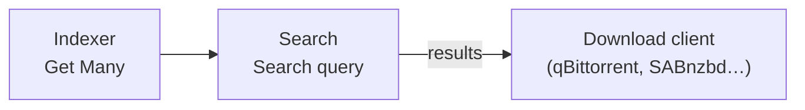

# n8n-nodes-prowlarr

[](https://www.npmjs.com/package/n8n-nodes-prowlarr)
[](https://www.npmjs.com/package/n8n-nodes-prowlarr)
[](./LICENSE)
[](https://docs.n8n.io/integrations/community-nodes/installation/verified-install/)

Community node for n8n to interact with **[Prowlarr](https://prowlarr.com/)** — list
indexers, run searches across them, read system status/health and trigger commands.

> ✅ **Verified community node** — available directly from the node panel on n8n
> (self-hosted **and** n8n Cloud).

## Installation

This is a **verified** community node: in n8n, click **+ (Add node)**, search for
**Prowlarr**, and add it — no manual install needed.

<details>
<summary>Manual install (older n8n, or as an unverified package)</summary>

**Settings → Community Nodes → Install** → `n8n-nodes-prowlarr`. Manual / Docker
deployment is also documented further down.
</details>

Then create a **Prowlarr API** credential with your instance URL and API key (see below).

## What it does

A single **Prowlarr** node with actions grouped by resource:

| Resource | Operation | Prowlarr endpoint |
|---|---|---|
| **Indexer** | Get Many | `GET /api/v1/indexer` |
| **Indexer** | Get | `GET /api/v1/indexer/{id}` |
| **Search** | Search | `GET /api/v1/search` |
| **System** | Get Status | `GET /api/v1/system/status` |
| **System** | Get Health | `GET /api/v1/health` |
| **Command** | Trigger | `POST /api/v1/command` |

## Prerequisites

- A running Prowlarr instance reachable from n8n.
- Your Prowlarr API key (**Settings → General → Security → API Key**).

## Credentials

In n8n, create a **Prowlarr API** credential:

- **Base URL** — e.g. `http://prowlarr:9696` (no trailing slash)
- **API Key** — your Prowlarr API key (sent as the `X-Api-Key` header)

The credential test calls `GET /api/v1/system/status`.

## Typical flow: search across all indexers

1. **Indexer → Get Many** → see the configured indexers and their IDs
2. **Search → Search** (`query` = *Ubuntu 24.04*) → aggregated results from every indexer
3. Feed the results (magnet / download URL) into your download client



## Build

```bash
npm install --ignore-scripts
npm run build                  # tsc + copy icons into dist/
```

## Deploy to a self-hosted (Docker) n8n

n8n auto-loads packages placed in `~/.n8n/custom/node_modules/`. If your n8n
data dir is bind-mounted from the host into the container, copy the built package into it:

```bash
# from the project dir, after `npm run build`
mkdir -p /path/to/n8n-data/custom/node_modules
cp -r . /path/to/n8n-data/custom/node_modules/n8n-nodes-prowlarr
# then restart n8n so it re-scans custom nodes
docker restart n8n
```

Only `package.json` + `dist/` are needed at runtime (`n8n-workflow` is a peer dependency
provided by n8n itself).

## Notes

- **Search** accepts a query plus optional indexer / category filters; results are
  normalised across Torznab & Newznab indexers by Prowlarr.
- **Command → Trigger** runs Prowlarr commands by name (e.g. `ApplicationIndexerSync`);
  see the Prowlarr API docs for available commands.

## Disclaimer

This is an unofficial community node and is not affiliated with or endorsed by the
Prowlarr / Servarr project. "Prowlarr" is the property of its respective authors.

## License

[MIT](./LICENSE)
